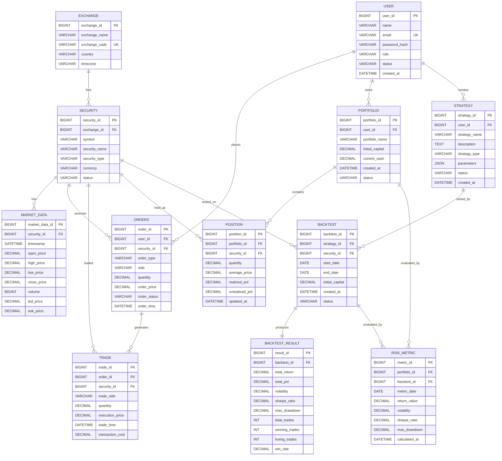

# QuantDB — Entity Relationship Diagram

**Project Name:** QuantDB  
**Full Name:** A Database-Driven Market Data and Algorithmic Trading Research Platform  
**Version:** 1.0  
**Document Status:** Initial ER Design Specification

---

## 1. Purpose

This document defines the Entity Relationship (ER) model for the QuantDB project.

The ER model represents the major entities, attributes, primary keys, foreign keys, relationships, and cardinalities required for the database-driven quantitative finance research and simulated trading platform.

The ER design serves as the foundation for the relational schema and MySQL database implementation.

---

# 2. Main Entities

QuantDB contains the following major entities:

1. USER
2. EXCHANGE
3. SECURITY
4. MARKET_DATA
5. ORDERS
6. TRADE
7. PORTFOLIO
8. POSITION
9. STRATEGY
10. BACKTEST
11. BACKTEST_RESULT
12. RISK_METRIC

---

# 3. Entity Definitions

## 3.1 USER

Represents a registered system user.

### Attributes

| Attribute | Description | Key |
|---|---|---|
| user_id | Unique user identifier | PK |
| name | User's name | |
| email | User's email address | UNIQUE |
| password_hash | Securely stored password hash | |
| role | User role | |
| status | Account status | |
| created_at | Account creation timestamp | |

### Roles

The system supports:

- Admin
- Quant Researcher
- Simulated Trader

---

## 3.2 EXCHANGE

Represents a financial exchange or market venue.

### Attributes

| Attribute | Description | Key |
|---|---|---|
| exchange_id | Unique exchange identifier | PK |
| exchange_name | Name of the exchange | |
| exchange_code | Unique exchange code | UNIQUE |
| country | Country of the exchange | |
| timezone | Exchange timezone | |

---

## 3.3 SECURITY

Represents a financial instrument traded on an exchange.

### Attributes

| Attribute | Description | Key |
|---|---|---|
| security_id | Unique security identifier | PK |
| exchange_id | Associated exchange | FK |
| symbol | Trading symbol | |
| security_name | Name of the security | |
| security_type | Type of security | |
| currency | Trading currency | |
| status | Security status | |

Examples of security types include:

- Equity
- ETF
- Index
- Future
- Other supported instruments

---

## 3.4 MARKET_DATA

Stores historical market data for securities.

### Attributes

| Attribute | Description | Key |
|---|---|---|
| market_data_id | Unique market data record | PK |
| security_id | Associated security | FK |
| timestamp | Date/time of observation | |
| open_price | Opening price | |
| high_price | Highest price | |
| low_price | Lowest price | |
| close_price | Closing price | |
| volume | Trading volume | |
| bid_price | Best available bid price | |
| ask_price | Best available ask price | |

### Constraint

```text
UNIQUE(security_id, timestamp)
```

This prevents duplicate market-data records for the same security and timestamp.

---

## 3.5 ORDERS

Represents simulated buy or sell orders submitted by users.

### Attributes

| Attribute | Description | Key |
|---|---|---|
| order_id | Unique order identifier | PK |
| user_id | User who placed the order | FK |
| security_id | Security being traded | FK |
| order_type | Type of order | |
| side | BUY or SELL | |
| quantity | Number of units | |
| order_price | Requested order price | |
| order_status | Current order status | |
| order_time | Time when order was submitted | |

The system supports simulated trading only.

---

## 3.6 TRADE

Represents the execution of a simulated order.

### Attributes

| Attribute | Description | Key |
|---|---|---|
| trade_id | Unique trade identifier | PK |
| order_id | Related order | FK |
| security_id | Traded security | FK |
| trade_side | BUY or SELL | |
| quantity | Executed quantity | |
| execution_price | Actual simulated execution price | |
| trade_time | Execution timestamp | |
| transaction_cost | Simulated transaction cost | |

---

## 3.7 PORTFOLIO

Represents a collection of securities and cash managed by a user.

### Attributes

| Attribute | Description | Key |
|---|---|---|
| portfolio_id | Unique portfolio identifier | PK |
| user_id | Portfolio owner | FK |
| portfolio_name | Name of portfolio | |
| initial_capital | Starting capital | |
| current_cash | Current available cash | |
| created_at | Portfolio creation timestamp | |
| status | Portfolio status | |

---

## 3.8 POSITION

Represents a user's holding of a particular security inside a portfolio.

### Attributes

| Attribute | Description | Key |
|---|---|---|
| position_id | Unique position identifier | PK |
| portfolio_id | Associated portfolio | FK |
| security_id | Held security | FK |
| quantity | Current quantity held | |
| average_price | Average acquisition price | |
| realized_pnl | Realized profit/loss | |
| unrealized_pnl | Unrealized profit/loss | |
| updated_at | Last update timestamp | |

### Constraint

```text
UNIQUE(portfolio_id, security_id)
```

A portfolio should have at most one active position record for a particular security.

---

## 3.9 STRATEGY

Represents a quantitative trading strategy created by a user.

### Attributes

| Attribute | Description | Key |
|---|---|---|
| strategy_id | Unique strategy identifier | PK |
| user_id | Strategy owner/creator | FK |
| strategy_name | Name of strategy | |
| description | Strategy description | |
| strategy_type | Strategy category | |
| parameters | Strategy parameters | |
| status | Strategy status | |
| created_at | Strategy creation timestamp | |

Examples:

- Moving Average
- Momentum
- Mean Reversion
- Statistical Strategy

---

## 3.10 BACKTEST

Represents an execution of a strategy against historical market data.

### Attributes

| Attribute | Description | Key |
|---|---|---|
| backtest_id | Unique backtest identifier | PK |
| strategy_id | Strategy being tested | FK |
| security_id | Security used in backtest | FK |
| start_date | Backtest start date | |
| end_date | Backtest end date | |
| initial_capital | Initial simulated capital | |
| created_at | Backtest creation timestamp | |
| status | Backtest status | |

---

## 3.11 BACKTEST_RESULT

Stores the performance result of a backtest.

### Attributes

| Attribute | Description | Key |
|---|---|---|
| result_id | Unique result identifier | PK |
| backtest_id | Associated backtest | FK |
| total_return | Total strategy return | |
| total_pnl | Total profit/loss | |
| volatility | Return volatility | |
| sharpe_ratio | Risk-adjusted return | |
| max_drawdown | Maximum portfolio decline | |
| total_trades | Total number of trades | |
| winning_trades | Number of winning trades | |
| losing_trades | Number of losing trades | |
| win_rate | Percentage of winning trades | |

---

## 3.12 RISK_METRIC

Stores calculated risk and performance metrics for portfolios or backtests.

### Attributes

| Attribute | Description | Key |
|---|---|---|
| metric_id | Unique metric identifier | PK |
| portfolio_id | Associated portfolio | FK, Nullable |
| backtest_id | Associated backtest | FK, Nullable |
| metric_date | Date of metric calculation | |
| return_value | Calculated return | |
| volatility | Calculated volatility | |
| sharpe_ratio | Calculated Sharpe ratio | |
| max_drawdown | Calculated maximum drawdown | |
| calculated_at | Calculation timestamp | |

`portfolio_id` or `backtest_id` may be used depending on whether the metric belongs to a live simulated portfolio or a historical backtest.

---

# 4. Entity Relationships

## 4.1 EXCHANGE — SECURITY

**Relationship:** An exchange lists multiple securities.

```text
EXCHANGE 1 ───────── M SECURITY
```

- One exchange can have many securities.
- Each security belongs to one exchange.

**Cardinality:** `1:M`

---

## 4.2 SECURITY — MARKET_DATA

**Relationship:** A security has many market-data records.

```text
SECURITY 1 ───────── M MARKET_DATA
```

- One security can have many historical market-data records.
- Each market-data record belongs to one security.

**Cardinality:** `1:M`

---

## 4.3 USER — ORDERS

**Relationship:** A user can place multiple simulated orders.

```text
USER 1 ───────── M ORDERS
```

- One user can place many orders.
- Each order is placed by one user.

**Cardinality:** `1:M`

---

## 4.4 SECURITY — ORDERS

**Relationship:** A security can be associated with many orders.

```text
SECURITY 1 ───────── M ORDERS
```

- One security can have many buy/sell orders.
- Each order is associated with one security.

**Cardinality:** `1:M`

---

## 4.5 ORDERS — TRADE

**Relationship:** An order may produce one or more trade executions.

```text
ORDERS 1 ───────── M TRADE
```

This design supports partial execution.

For example, an order for 100 units can be executed as:

```text
Trade 1 → 40 units
Trade 2 → 35 units
Trade 3 → 25 units
```

Therefore:

**Cardinality:** `1:M`

---

## 4.6 USER — PORTFOLIO

**Relationship:** A user can manage multiple portfolios.

```text
USER 1 ───────── M PORTFOLIO
```

- One user can own multiple portfolios.
- Each portfolio belongs to one user.

**Cardinality:** `1:M`

---

## 4.7 PORTFOLIO — POSITION

**Relationship:** A portfolio contains multiple positions.

```text
PORTFOLIO 1 ───────── M POSITION
```

- One portfolio can contain many positions.
- Each position belongs to one portfolio.

**Cardinality:** `1:M`

---

## 4.8 SECURITY — POSITION

**Relationship:** A security can appear in positions across multiple portfolios.

```text
SECURITY 1 ───────── M POSITION
```

- One security can be held by many portfolios.
- Each position refers to one security.

**Cardinality:** `1:M`

The combination:

```text
(portfolio_id, security_id)
```

is unique.

---

## 4.9 USER — STRATEGY

**Relationship:** A user can create multiple quantitative strategies.

```text
USER 1 ───────── M STRATEGY
```

- One user can create many strategies.
- Each strategy belongs to one user.

**Cardinality:** `1:M`

---

## 4.10 STRATEGY — BACKTEST

**Relationship:** A strategy can be tested multiple times.

```text
STRATEGY 1 ───────── M BACKTEST
```

- One strategy can have multiple backtests.
- Each backtest uses one strategy.

**Cardinality:** `1:M`

---

## 4.11 SECURITY — BACKTEST

**Relationship:** A security can be used in multiple backtests.

```text
SECURITY 1 ───────── M BACKTEST
```

- One security can be used in many backtests.
- Each backtest is associated with one security.

**Cardinality:** `1:M`

---

## 4.12 BACKTEST — BACKTEST_RESULT

**Relationship:** A backtest produces its performance result.

```text
BACKTEST 1 ───────── 1 BACKTEST_RESULT
```

- One completed backtest has one summarized result.
- Each backtest result belongs to one backtest.

**Cardinality:** `1:1`

---

## 4.13 PORTFOLIO — RISK_METRIC

**Relationship:** A portfolio can have multiple historical risk-metric records.

```text
PORTFOLIO 1 ───────── M RISK_METRIC
```

**Cardinality:** `1:M`

---

## 4.14 BACKTEST — RISK_METRIC

**Relationship:** A backtest can have associated risk/performance metrics.

```text
BACKTEST 1 ───────── M RISK_METRIC
```

**Cardinality:** `1:M`

---

# 5. Overall ER Relationship Summary

| Parent Entity | Child Entity | Cardinality | Foreign Key |
|---|---|---:|---|
| EXCHANGE | SECURITY | 1:M | SECURITY.exchange_id |
| SECURITY | MARKET_DATA | 1:M | MARKET_DATA.security_id |
| USER | ORDERS | 1:M | ORDERS.user_id |
| SECURITY | ORDERS | 1:M | ORDERS.security_id |
| ORDERS | TRADE | 1:M | TRADE.order_id |
| SECURITY | TRADE | 1:M | TRADE.security_id |
| USER | PORTFOLIO | 1:M | PORTFOLIO.user_id |
| PORTFOLIO | POSITION | 1:M | POSITION.portfolio_id |
| SECURITY | POSITION | 1:M | POSITION.security_id |
| USER | STRATEGY | 1:M | STRATEGY.user_id |
| STRATEGY | BACKTEST | 1:M | BACKTEST.strategy_id |
| SECURITY | BACKTEST | 1:M | BACKTEST.security_id |
| BACKTEST | BACKTEST_RESULT | 1:1 | BACKTEST_RESULT.backtest_id |
| PORTFOLIO | RISK_METRIC | 1:M | RISK_METRIC.portfolio_id |
| BACKTEST | RISK_METRIC | 1:M | RISK_METRIC.backtest_id |

---

# 6. Mermaid ER Diagram

The following Mermaid diagram represents the logical ER structure of QuantDB.



---

# 7. Important Design Decisions

## 7.1 Separate SECURITY from MARKET_DATA

Security master information and time-series market data are stored separately.

This avoids repeatedly storing:

```text
symbol
security_name
security_type
currency
```

for every market-data record.

---

## 7.2 Separate ORDERS from TRADE

An order represents an instruction to buy or sell.

A trade represents an actual simulated execution.

This separation allows the system to support partial executions.

Example:

```text
Order Quantity = 100

Trade 1 = 40
Trade 2 = 35
Trade 3 = 25
```

---

## 7.3 Separate PORTFOLIO from POSITION

A portfolio represents the overall investment account.

A position represents the holding of a particular security inside that portfolio.

Therefore:

```text
Portfolio
    |
    +-- Position: AAPL
    +-- Position: MSFT
    +-- Position: NVDA
```

---

## 7.4 Separate STRATEGY from BACKTEST

A strategy represents the trading logic.

A backtest represents one historical experiment using that strategy.

The same strategy can therefore be tested with:

- different securities;
- different date ranges;
- different initial capital;
- different parameters.

---

## 7.5 Separate BACKTEST_RESULT from BACKTEST

The backtest stores the configuration and execution information.

The backtest result stores calculated performance metrics such as:

- Total Return
- Total P&L
- Volatility
- Sharpe Ratio
- Maximum Drawdown
- Number of Trades
- Win Rate

---

# 8. Data Flow Through the ER Model

The major system data flow is:

```text
EXCHANGE
    ↓
SECURITY
    ↓
MARKET_DATA
    ↓
STRATEGY
    ↓
BACKTEST
    ↓
BACKTEST_RESULT
    ↓
RISK_METRIC
```

The simulated trading flow is:

```text
USER
  ↓
ORDERS
  ↓
TRADE
  ↓
POSITION
  ↓
PORTFOLIO
  ↓
RISK_METRIC
```

The complete research and trading relationship can therefore be represented as:

```text
Market Data
     ↓
Security
     ↓
Strategy
     ↓
Backtest
     ↓
Performance Metrics
```

and:

```text
User
 ├── Portfolio
 │      └── Position
 │             └── Security
 │
 ├── Orders
 │      └── Trades
 │
 └── Strategies
        └── Backtests
               └── Results
```

---

# 9. Referential Integrity

Foreign-key relationships ensure that related records cannot reference nonexistent parent records.

Examples:

```text
SECURITY.exchange_id
        ↓
EXCHANGE.exchange_id
```

```text
MARKET_DATA.security_id
        ↓
SECURITY.security_id
```

```text
ORDERS.user_id
        ↓
USER.user_id
```

```text
TRADE.order_id
        ↓
ORDERS.order_id
```

```text
POSITION.portfolio_id
        ↓
PORTFOLIO.portfolio_id
```

```text
BACKTEST.strategy_id
        ↓
STRATEGY.strategy_id
```

```text
BACKTEST_RESULT.backtest_id
        ↓
BACKTEST.backtest_id
```

This maintains consistency across the database.

---

# 10. ER Design to Relational Schema Mapping

Each major ER entity maps to a relational table:

```text
USER              → USER
EXCHANGE          → EXCHANGE
SECURITY          → SECURITY
MARKET_DATA       → MARKET_DATA
ORDERS            → ORDERS
TRADE             → TRADE
PORTFOLIO         → PORTFOLIO
POSITION          → POSITION
STRATEGY          → STRATEGY
BACKTEST          → BACKTEST
BACKTEST_RESULT   → BACKTEST_RESULT
RISK_METRIC       → RISK_METRIC
```

Primary keys uniquely identify records, while foreign keys implement relationships between entities.

---

# 11. ER Design Validation Checklist

The ER design satisfies the following requirements:

- [x] All major project entities identified.
- [x] Primary keys defined.
- [x] Foreign keys defined.
- [x] Entity attributes defined.
- [x] Relationships identified.
- [x] Cardinalities specified.
- [x] Market data separated from security master data.
- [x] Orders separated from trade executions.
- [x] Portfolios separated from positions.
- [x] Strategies separated from backtests.
- [x] Backtest results separated from backtest configuration.
- [x] Referential integrity considered.
- [x] ER model mapped to relational tables.
- [x] Design supports normalization.
- [x] Design supports SQL queries and analytics.
- [x] Design supports simulated trading.
- [x] Design supports quantitative research and backtesting.

---

# 12. Conclusion

The QuantDB ER model provides a structured representation of the database required for market data management, simulated trading, portfolio management, quantitative strategy research, backtesting, and risk analysis.

The design separates independent entities, establishes clear primary and foreign key relationships, minimizes redundancy, and provides a strong foundation for the MySQL relational database implementation.

The ER model will be used as the reference design for implementing the database schema and SQL scripts in the `database/` directory.